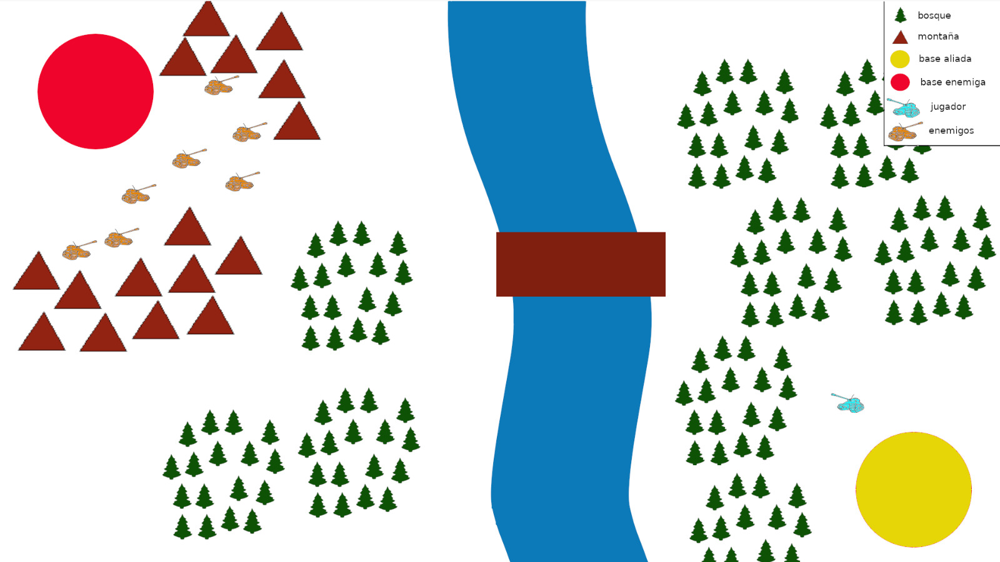

# Tarea_Videojuego_Interfaces_Inteligentes
## Juego de los Tanques basado en VR para captar más soldados a las Fuerzas Armadas de España

##### Autores:
* Alien Embarec Riadi
* Antonio Chávez López
    
##### La historia del juego

Nos hemos propuesto desarrollar un videojuego basado en realidad virtual, el usuario, mediante unas gafas, un Joystick y una pantalla de televisión,puede conducir diversos tanques de guerra y vehículos de combate, realizar misiones de vigilancia, búsqueda de objetivos, entre otras funciones que se irán desarrollando en varias versiones.

##### Qué apariencia tendrá

El escenario del videojuego es un campo abierto, con obstáculos representados en bosques,ríos,montañas,baja visibilidad.

##### El objetivo del jugador

El objetivo del jugador es cumplir la misión que se le orden, podrá ser moverse por el campo para reconocer un objetivo, disparar a un objetivo,defender una zona.

##### Los personajes: su comportamiento, y cómo se controla

Los personajes serán:
		* Enemigos en general: personas.

		*El conductor principal del tanque.

##### Los objetos en la escena: su comportamiento etc...

Los objetos serán vehículos en general, todo tipo de inmuebles, bosques, ríos, montañas, pastos.

##### Qué acciones puede llevar a cabo el usuario.

 Moverse,frenar,acelerar, cambiar visión tanque, disparar, girar cañón.

##### Las animaciones

Sería el propio tanque en movimiento, las balas del tanque, explosiones, giro del cañón, movimientos de los otros vehículos y personas.

##### El audio

Se generan sonidos diferentes cuando:

	*Una bala impacta en el enemigo
	*El movimiento del propio tanque
	*Cuando gira el cañón
	*Disparo del cañón
	*Cuando se reciben disparon del ememigo
	*Impactos en el propio tanque

##### La inteligencia artificial 

Los enemigos usarán la inteligencia para hacer que no cumplas tu misión, pondrán obstáculos en el camino,atacarán tu zona.

##### Condiciones para ganar

Cumplir la misión, hay tres tipos de misiones: atacar una zona enemiga y conquistarla, defender tu propia zona, y por último, realizar una tarea de reconocimiento sin que se destruya tu tanque.

##### Si el personaje muere dónde aparecerá 

Aparecerá en su base.

##### Sistema de puntuación

Dependerá de las bajas causadas al enemigo y/o cumplir la misión. Perderás puntos si eres destruido o fallas la misión.

##### Mockup

