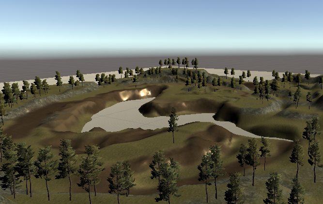
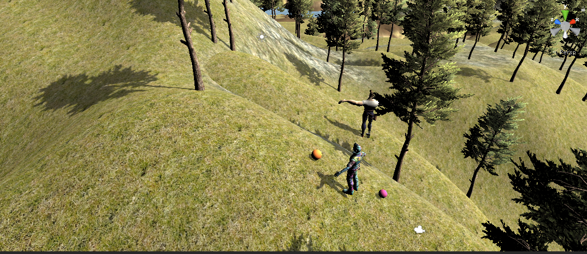

###### Práctica Introducción a Unity

## Viernes 4 Octubre 2019

* Autor : Alien Embarec Riadi

En esta práctica hemos creado una escena básica en Unity, añadiéndole objetos 3D como árboles, fuentes de agua, dos personajes de la AssetStore, esferas, terrenos, y dos focos de luz.

Finalmente se ha agregado de la AssetStore una especie de parque con abundante vegetación, un espacio para ubicar un lago,postes de electricidad, etc. 

Todo esto combinado con los elementos anteriormente mencionados, nos permite configurar un paisaje verde.

Debido a un problema con el sistema de  control de versiones Unity Collab, que no guardaba todos los componentes del proyecto, no tenía acceso a las copias de mis trabajos que había empezado en el CC de la ESIT. Por ello, empecé la tarea de nuevo en mi ordenador personal. Aquí dejo algunas fotos de lo que hice:

